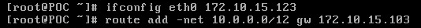
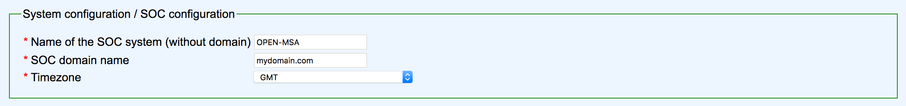
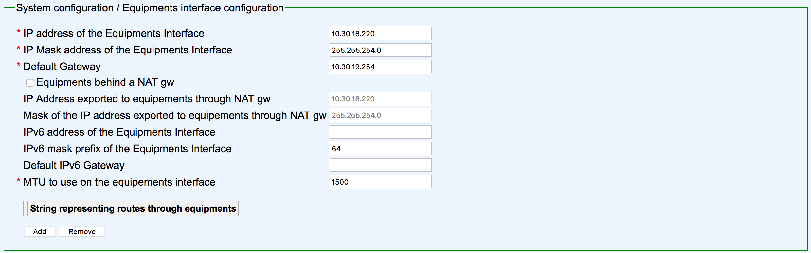
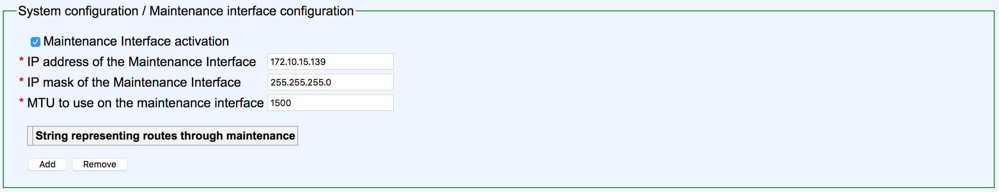
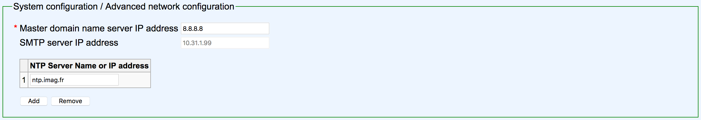
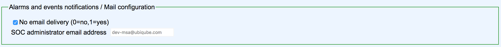
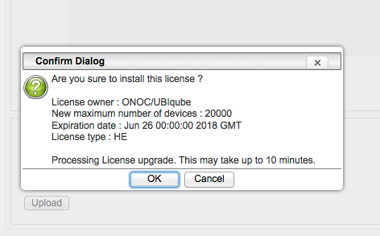
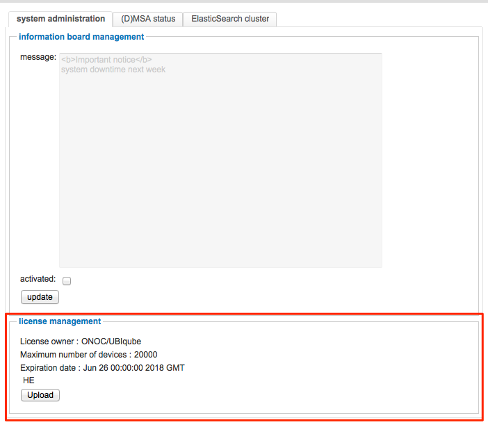

# How to install and activate the OpenMSA freeware

The OpenMSA Freeware is an evaluation/dev/test platform available
as an .ova VM image which can be downloaded from the UBIqube portal.

Please proceed with the free registration form in order to download
a.) the .ova VM image file and b.) the .lic evaluation license file.
The evaluation license is valid for 30 days and provides for 10 devices.

The .lic file on the UBIqube download portal is updated daily, so a
fresh license can be installed again as required for another 30 days.

The root password for the .ova is: OpenMSA

## OpenMSA installation
### Interface configuration

Sometimes interfaces eth0 and eth1 are not visible. You have to edit the interface configuration file:
<pre>
[root@OpenMSA]#cd /etc/sysconfig/network-scripts
[root@OpenMSA network-scripts]#vi ifcfg-eth0
</pre>
remove reference to UUID and HWADDR the file should be like
<pre>
DEVICE="eth0"
BOOTPROTO="none"
IPV6INIT="yes"
IPV6_AUTOCONF="yes"
NM_CONTROLLED="yes"
ONBOOT="yes"
TYPE="Ethernet"
IPADDR=10.31.1.14
NETMASK=255.255.255.0
GATEWAY=10.31.1.254
</pre>
Do the same with ifcfg-eth1

Then you can activate interfaces:
<pre>
[root@OpenMSA network-scripts]# ifup ifcfg-eth0
[root@OpenMSA network-scripts]# ifup ifcfg-eth1
</pre>
If an error occur:
<pre>
[root@OpenMSA]# echo "" > /etc/udev/rules.d/70-persistent-net.rules
[root@OpenMSA]#reboot
</pre>

### Configure the OpenMSA

Once the OVA is installed, start the VM. You should see the OpenMSA services starting messages in the console.

Make sure that the network setup of the VM are correctly set as well as the other parameters such as CPU, Disk,...

The MSActivator deploys with 50Gb disk but you may want to extends this to allow more flexibility later.

Connect as root to the MSActivator.

The following steps explain how to configure the network interface eth0 in order to be able to use the online configuration tool

configure eth0 with an address from your network:

and try to access http://ip_configured:3577/config.xml (login:socconfig password:b5ty9uvh4)

Then follow the instructions about the online configuration tool below

### Online configuration tool

This is the configuration method for the OpenMSA freeware.
access: http://w.x.y.z:3577/config.xml (socconfig/b5ty9uvh4) 
the access is only available through eth0 (maintenance interface). 

* eth0 is the interface dedicated to maintenance 
* eth1 is the interface dedicated to device management

#### OpenMSA information

#### Company information

#### Management interface configuration

#### Maintenance interface configuration

#### SMTP and DNS configuration

#### Alarm and event configuration

#### Run the configuration
choose the option to apply configuration and reboot.
The configuration will take around 5-10 minutes depending on the resources (CPU/Mem) allocated to the OpenMSA 

## OpenMSA activation
### Install the evaluation license file 

The evaluation license file can be downloaded from the UBiqube community partner portal.

To install the license you must be connected as a privileged administrator (ncroot) on the new portal.

As an privilege administrator, click on the MSActiavtor setting icon on the top 

Clicking on this icon, you will access the system management UI where the license management is.

click on upload and select your file.

Once uploaded, and before being really installed, the MSA will show you the certificate information like number of devices manageable and end of support time.
Checks theses informations and if this is ok for you, apply.

The apply dialog box look like this:

The updated UI should show the actuall license information

